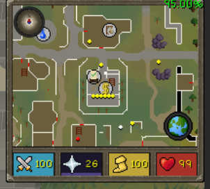

# Mystic HUD

Moves the minimap and orbs into a rectangular block that sits above the inventory in
resizable modern mode, styled to match the Mystic resource pack.

- Square minimap instead of the circular one
- Health, prayer, run and special attack as colour filled blocks in a row, in your
  chosen order, filling to the live value
- Small compass on the map, click it to face north
- Attach the block onto the inventory so they read as one panel, or alt drag it anywhere
- Optional xp and world map orbs, hide the block while no side panel is open

