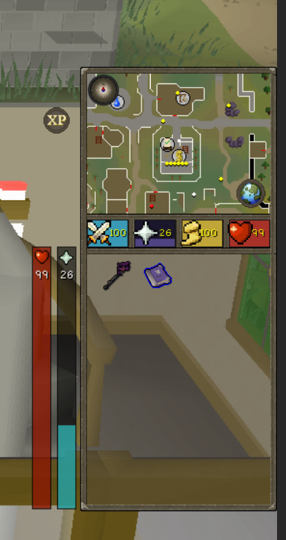

# Mystic HUD

Moves the minimap and orbs into a rectangular block that sits above the inventory, in
either resizable layout.

- Square minimap instead of the circular one
- Health, prayer, run and special attack as colour filled blocks in a row, in your
  chosen order, filling to the live value
- Poison, venom and disease colour the health block, and the run and prayer icons
  follow the game's own art for stamina and quick prayers
- Small compass on the map, click it to face north
- Frame drawn in the game's own border art, or switch it to your resource pack's
- Optional xp and world map orbs, hide the block while no side panel is open
- Works in resizable modern and resizable classic

Attach the block onto the inventory so the two read as one panel, or shift drag it
anywhere you like.

